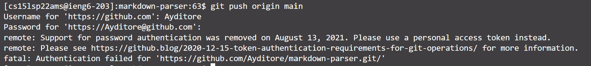

# Welcome to Anthony's Lab Report

In this report, I would like to show you how I manged to complete three tasks in lab 5.  

## Streamlining ssh Configuration  

* Firstly, find the **.ssh** folder on local computer. 


* In the folder, the file called **id_rsa.pub** exists. It is a file which I used to store my passward on this computer tp login the server without typing the passward  

* Now, to make the login process even more quicker. I create a **txt** file called **config.txt**, and I type the following text into the txt file:

```
Host ieng6
    HostName ieng6.ucsd.edu
    User cs15lsp22ang (This is my username)
```  


* Then, save the file and delete the **.txt** extension


* Now, open a terminal and only type in **ssh ieng6**. As shown in the following screenshot, I do not even need to type in username to login to the server.  
* The login process is now faster! 


* Then, I used the `scp` command with **scp [file name] ieng6:~/** to copy a file from local computer to the server.


* After login, we can see that the file is successfully updated.


---
## Setup Github Access from ieng6

* First, I cloned my markdown-parser repo onto the ieng6 server


* From the picture, we can see that when `push` the file to the Github after making change, an error occurs after password authentication to access Github.



* To solve this issue, I generated a new public key in server by using the code of `ssh-keygen -t rsa -C "[github email]":


* The newly generated key is saved in the server `.ssh` file


* After generating the keys, I use `cat` to get public key from **id_rsa.pub** located in **.ssh** folder, and copy it to the *SSH key* in Github setting.


* Github Setting Page:


* Then I use Github SSH key clone, which is `git@github.com:Ayditore/markdown-parser.git` to clone *markdown-parser* to the *ieng6* server.


* After clone, I go into the *markdown-parser* directory and use `touch` to add a new blank text file called "hello.txt"


* Then I use `git add . ` and `git commit -m "[commit description]"` to add and commit to the Github.


* Last, I used `git push` to push commit to Github. Then we are now able to see the file I added from Github webpage.


[link to repo with hello.txt](https://github.com/Ayditore/markdown-parser)

---
